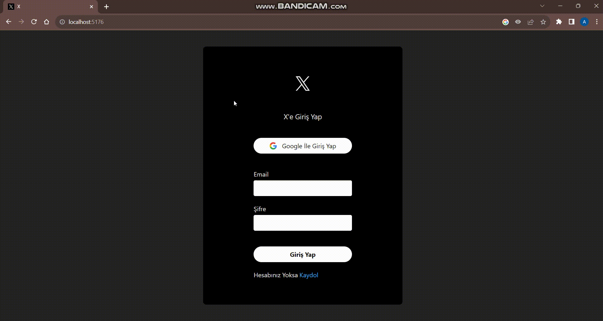

# X Clone 

# USED TECHNOLOGIES

- React Vite
- Tailwind CSS
- Firebase

# DESCRIPTION:
- This project includes a Twitter clone developed using React Vite, Tailwind CSS, and Firebase. The application mimics the core functionalities of Twitter

- Libraries:
npm install
- - "firebase"
- - "moment"
- - "react"
- - "react-dom"
- - "react-helmet"
- - "react-icons"
- - "react-router-dom"
- - "react-toastify"
- -  "uuid"

